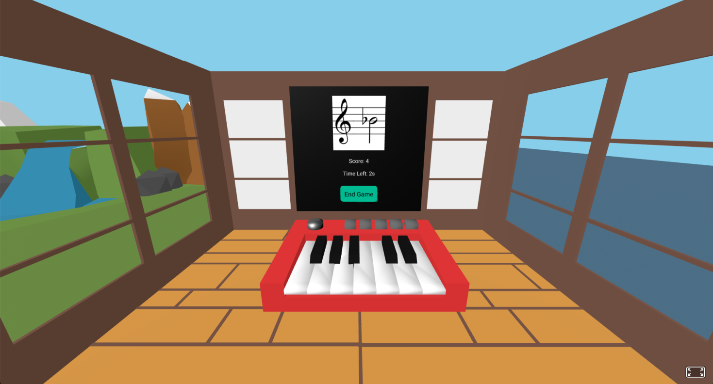

# Simple 3D Music Notes Learning Game


## Game rules
1. Before the game starts, the user sets the initial game time (e.g., 20 seconds), and bonus for playing the correct note.
2. The timer counts down. The game continues while **time > 0**.
3. A **random note** to be played is generated and displayed on the staff.
4. If the **displayed note** is played, a the **bonus number of  seconds fixed is added** to the timer, then the next note is shown.
5. The game ends when the timer reaches **zero**.

 **Notes are detected either from the computer keyboard or from the microphone** 
 (Sharps `#` are entered by holding **Shift** with the letter key, e.g., **Shift+F → F#**). 



## How to build and run
A simple 3D piano note trainer built with A‑Frame + SDS. A random target note appears on the HUD; your goal is to play it **either** on a real instrument via the **microphone** (pitch detection) **or** on your **computer keyboard**. When you play the correct note, you **get a time bonus** and a new target is shown. **Wrong notes do nothing.**

1. Clone the repository:
   ```
   git clone https://github.com/your-repo-link.git
   cd template
   ```
2. Install dependencies:
   ```
   npm install
   ```
3. Run the game in development mode:
   ```
   npm run dev
   ```
4. Build for production:
   ```
   npm run build
   ```

## How to use in your own project

1. After running `npm run build`, the output files will be in the `dist` folder.
2. Copy the entire `dist` folder to your project.
3. In your HTML embed the game via an iframe:
```HTML

<div id="game" class="section">
  <div id="game-root" class="w3-container">
    <iframe id="game-frame" src="http://localhost:8000/game"
            width="100%" height="800px" style="border:none;">
    </iframe>
  </div>
</div>
```

4. Serve the files as static assets. Example (Flask) when `dist` was copied to `static/`:
   ```python
   from flask import Flask, send_from_directory, render_template
   app = Flask(__name__)

   @app.route('/<path:path>')
   def serve_static(path):
       return send_from_directory('static', path)

   @app.route('/')
   def index():
       return send_from_directory('static', 'index.html')

   @app.route('/game')
   def game():
       return render_template('index.html')
    ```

    This game is a module of a larger Piano Learning Tool available at: [https://github.com/et1141/Piano-Learning-Tool]
